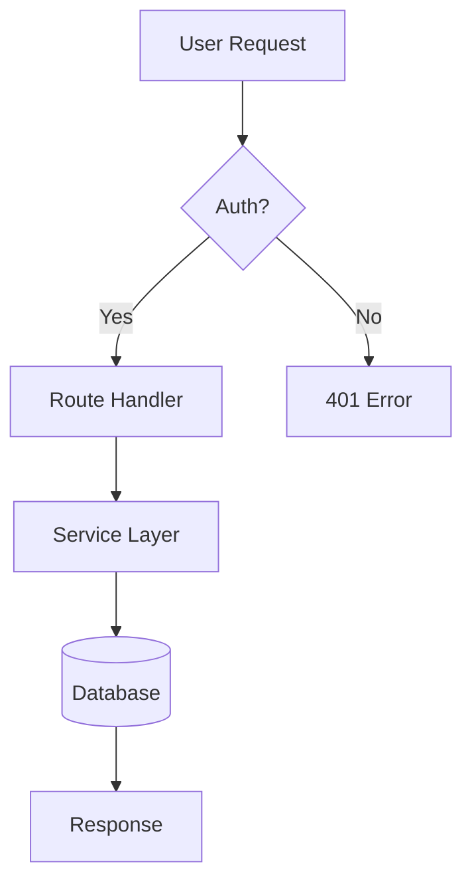
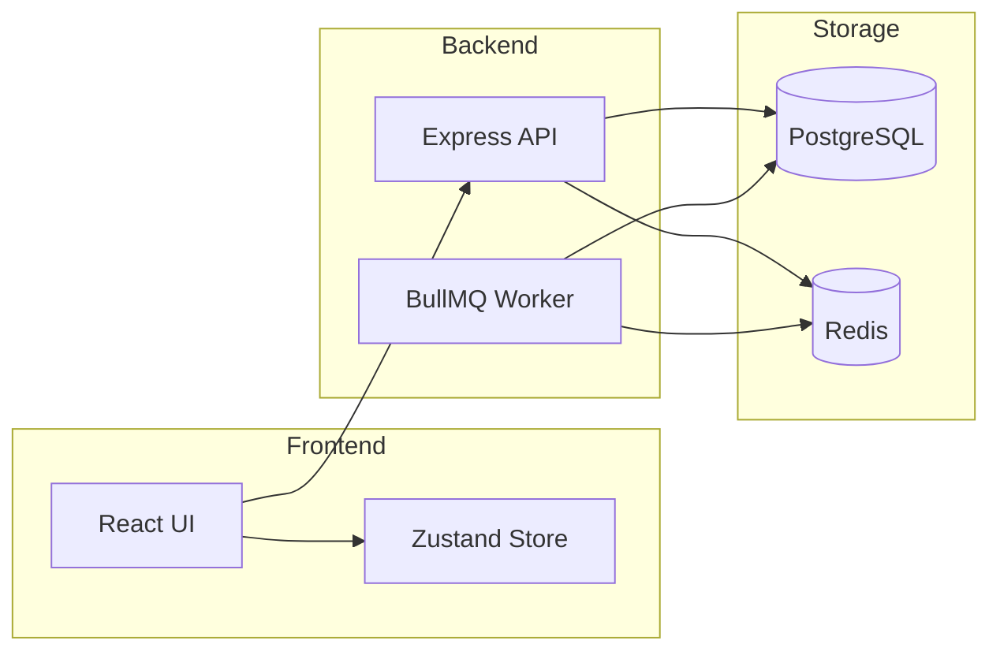
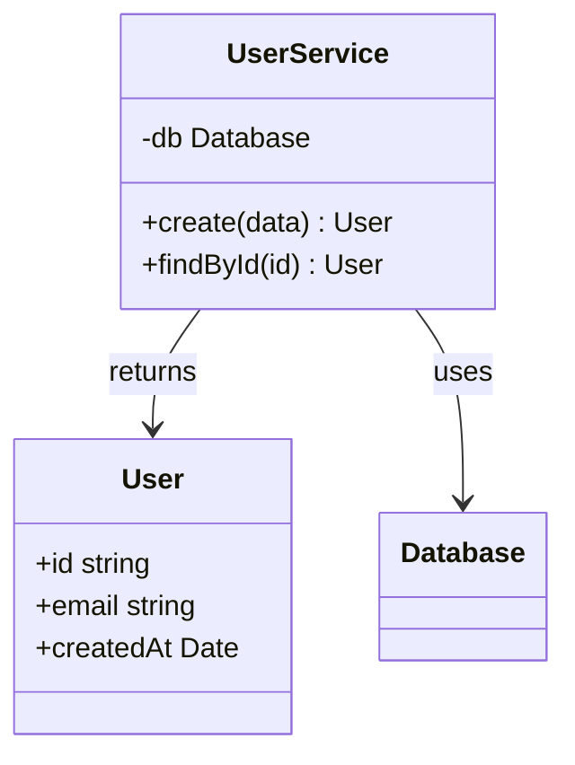
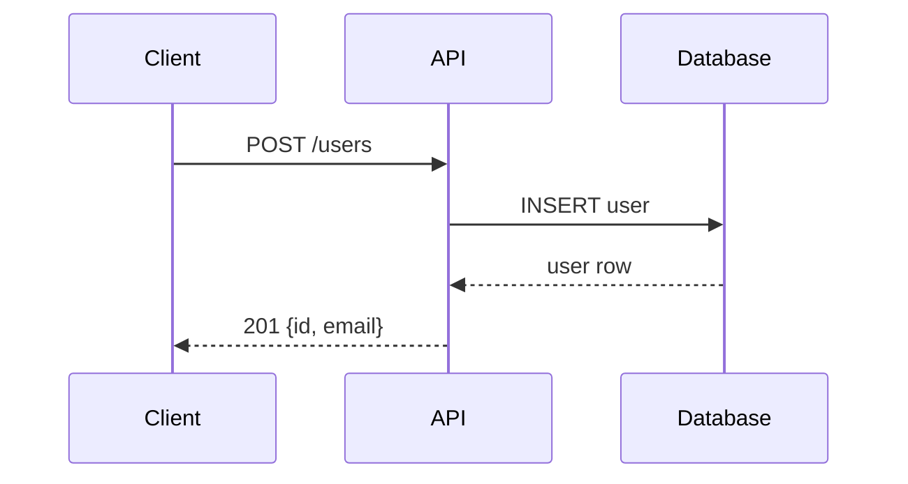
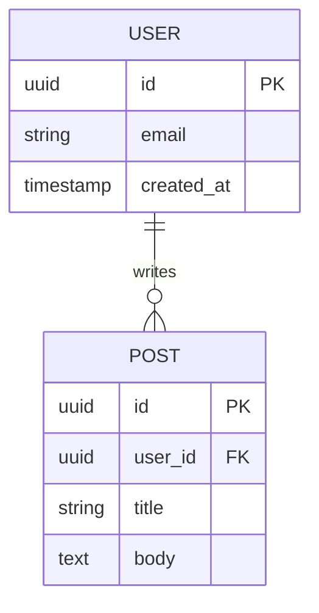
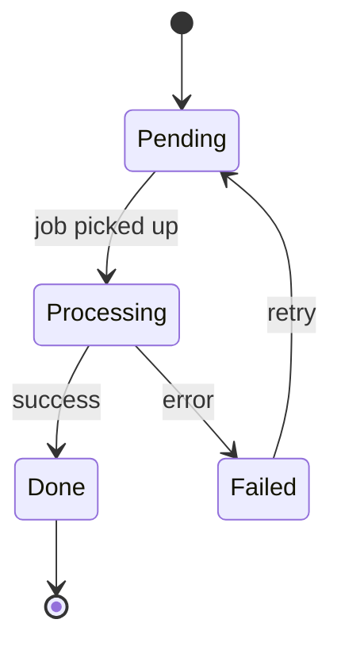

# Architecture Diagram Generator

Generates editable Mermaid diagrams and renders them to SVG/PNG.

## Workflow

### 1. Explore the codebase

Use the available tools to understand the project before diagramming:
```bash
scc --format json /workspace          # language/file overview (if scc skill available)
find /workspace/src -name "*.ts" -o -name "*.js" | head -40
```
Read key entry points, index files, and any existing architecture docs.

### 2. Write the Mermaid diagram

Choose the right diagram type for what you're visualising (see types below), write the Mermaid source to a file:

```
write /workspace/diagram.mmd
<mermaid source here>
```

### 3. Render to SVG

```bash
mmdc -i /workspace/diagram.mmd -o /workspace/diagram.svg -p /usr/local/lib/mmdc-config.json
```

Or render to PNG:
```bash
mmdc -i /workspace/diagram.mmd -o /workspace/diagram.png -p /usr/local/lib/mmdc-config.json
```

### 4. View the result (optional)

Open in the live browser:
```bash
node /usr/local/lib/browser.js '{"action":"navigate","url":"file:///workspace/diagram.svg"}'
```

Or open Mermaid Live editor for interactive editing:
```bash
node /usr/local/lib/browser.js '{"action":"navigate","url":"https://mermaid.live"}'
```
(Then paste the `.mmd` file contents into the editor.)

## Diagram Types

### Flowchart — data flow, logic, processes



### Component / Architecture



### Class diagram — OOP relationships



### Sequence diagram — API calls, message flows



### ER diagram — database schema



### State diagram — lifecycle, state machines



## Tips

- **Start simple** — one diagram per concept is better than one huge diagram
- **Focus on boundaries** — show how major modules/services communicate, not internal details
- **Label edges** — arrows without labels are often meaningless
- **Use subgraphs** to group related components
- If mmdc fails, paste the `.mmd` source into `https://mermaid.live` via the browser skill for instant rendering
